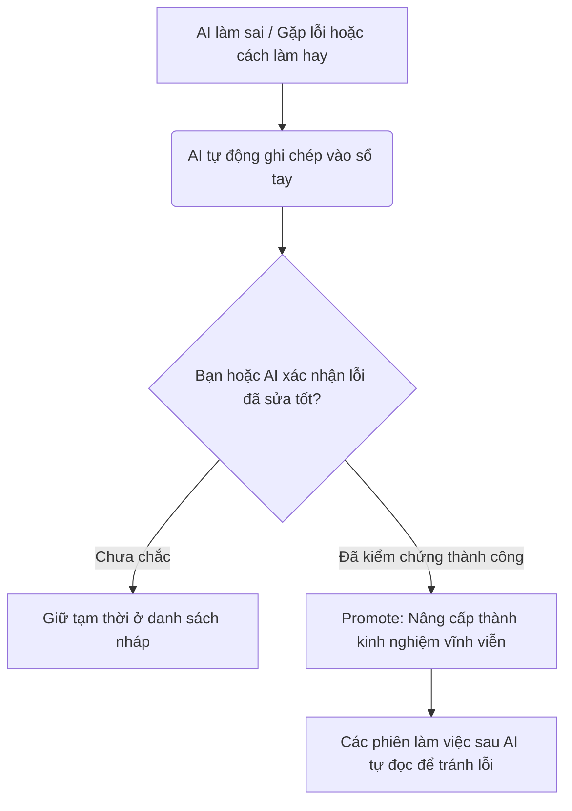

# Hướng Dẫn Sử Dụng Agent Growth Protocol (AGP) Cho Dân Không Chuyên (Notech) 📝

Bạn đang dùng các trợ lý AI như **Cursor**, **Claude Code**, **Aider**, hoặc các Agent tự động khác để viết code hay làm việc? Bạn có bao giờ bực mình khi:
*   AI cứ **lặp đi lặp lại một lỗi cũ** dù bạn đã sửa cho nó ở phiên làm việc trước?
*   AI bị **"loãng trí nhớ"** (hallucination) vì nhồi nhét quá nhiều thông tin rác vào bộ nhớ?
*   Bạn bị **lãng phí tiền API** (tokens) vô ích chỉ để AI thử đi thử lại một việc?

**Agent Growth Protocol (AGP)** ra đời để giải quyết triệt để vấn đề này!

---

## 💡 AGP Hoạt Động Như Thế Nào? (Giải Thích Bình Dân)

AGP giống như một **"Cuốn Sổ Tay Trí Khôn"** riêng tư được lưu trực tiếp trên máy tính của bạn:



1.  **Ghi chép (Capture):** Khi AI gặp lỗi hoặc tìm ra cách làm hay, nó sẽ tự động ghi chép lại (nháp).
2.  **Kiểm chứng (Verify):** Khi cách sửa lỗi đó được chứng minh là hoạt động tốt ở các lần sau, nó sẽ được đánh dấu là "đã xác nhận".
3.  **Tốt nghiệp (Promote):** Khi một bài học được lặp lại đủ nhiều và đáng tin cậy, nó sẽ trở thành **Luật cứng (Rule)** nằm trong bộ não vĩnh viễn của AI. Lần sau AI sẽ tự động tránh lỗi này mà không cần bạn nhắc nhở.

---

## ⚡ Hướng Dẫn Cài Đặt (Trong 1 Click)

Nếu bạn sử dụng các phần mềm lập trình phổ biến như **Cursor**, **Aider**, hay **Claude Code**... hãy chọn bản **Standalone** (chạy độc lập bằng cơ sở dữ liệu SQLite cực nhanh và bảo mật trên máy bạn).

### Cách cài đặt:
1.  Mở ứng dụng **Terminal** trên Mac (nhấn tổ hợp phím `Command + Space`, gõ `Terminal` rồi nhấn Enter) hoặc **PowerShell** trên Windows.
2.  Copy toàn bộ dòng lệnh dưới đây, dán vào Terminal/PowerShell và nhấn **Enter**:

```bash
curl -fsSL https://raw.githubusercontent.com/roverdude24/agent-growth-protocol/main/standalone/install.sh | bash
```

3.  Chờ vài giây cho màn hình hiện thông báo thành công. Vậy là xong!

---

## 🤖 Cách Sử Dụng Hằng Ngày (Cực Kỳ Đơn Giản)

Điểm tuyệt vời của AGP là **bạn không cần phải gõ lệnh kỹ thuật**. AI Agent của bạn sẽ tự làm việc đó thông qua cuộc hội thoại tự nhiên với bạn.

### 1. Khi AI làm sai hoặc bạn phải sửa lỗi cho nó:
Bạn chỉ cần nói với AI trong khung chat:
> *"Lỗi này quan trọng đấy, hãy tự log (ghi nhận) bài học này vào AGP để lần sau không lặp lại nhé."*
*AI sẽ tự chạy lệnh ngầm để lưu lại lỗi và cách khắc phục.*

### 2. Khi AI áp dụng thành công cách sửa cũ:
Bạn nói với AI:
> *"Cách sửa này hoạt động tốt rồi. Hãy chạy lệnh verify (xác nhận) cho bài học này trong AGP nhé."*
*AI sẽ tăng độ tin cậy của bài học đó lên.*

### 3. Khi bắt đầu một ngày làm việc mới:
Bạn nói với AI:
> *"Hãy chạy session-start trong AGP để xem hôm nay chúng ta cần lưu ý những bài học cũ nào nhé."*
*AI sẽ tự động đọc lại các kinh nghiệm cũ để chuẩn bị làm việc hiệu quả.*

---

## 📂 Xem Nhật Ký Học Tập Của AI Ở Đâu?

Mọi dữ liệu của bạn đều được lưu trữ hoàn toàn trên máy tính cá nhân của bạn, không gửi đi bất kỳ máy chủ nào khác.

Bạn có thể xem báo cáo chi tiết các bài học của AI bằng cách:
1.  Mở Finder (Mac) hoặc File Explorer (Windows).
2.  Đi tới thư mục người dùng của bạn (thường là `~/.agent_growth/` hoặc `C:\Users\Tên_Của_Bạn\.agent_growth\`).
3.  Mở file **`report.md`** bằng bất kỳ phần mềm đọc văn bản nào (như TextEdit, Notepad, Word, hoặc chính Cursor). Bạn sẽ thấy một bảng tổng hợp trực quan như thế này:
    *   **Open Learnings:** Các bài học đang nháp/chờ theo dõi.
    *   **Verified Learnings:** Các bài học đã xác nhận thành công.
    *   **Promotion Candidates:** Các bài học sắp được nâng cấp thành luật cứng.

Chúc bạn có một trải nghiệm làm việc mượt mà và không còn bực mình vì AI lặp lại lỗi cũ nữa! 🚀
