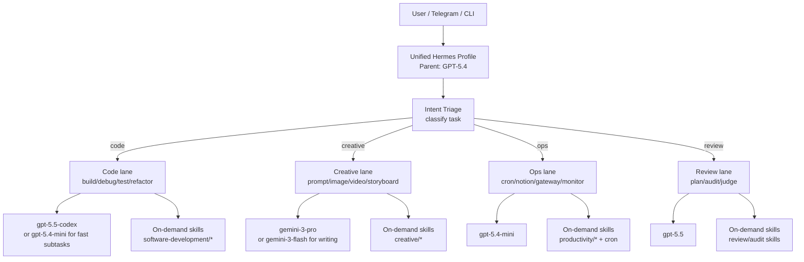

# Hermes Unified Profile

**Goal:** merge `builder`, `creative-production`, `executive-ops`, and `review-board` into one Hermes profile that keeps GPT-5.4 as the parent orchestrator and routes work by category through `delegate_task`.

This design is inspired by oh-my-opencode’s pattern:
- one parent brain
- category-based worker routing
- skills loaded only when needed
- specialized lanes, not specialized profiles

## 1) Architecture



### Design rules
- **Parent model stays GPT-5.4.** It owns the conversation, routing, synthesis, and final response.
- **Workers are delegated by category.** No separate profile switching.
- **Skills are lazy-loaded.** Nothing big stays always-on unless it is core policy.
- **The parent decides, the workers do, the parent verifies.**
- **Use cheap models for repetitive ops, strong models for judgment, and multimodal models for creative work.**

---

## 2) Category → model mapping

### Super-lanes
| Lane | Purpose | Delegate model |
|---|---|---|
| `code` | build, debug, test, refactor, implement | `gpt-5.5-codex` |
| `creative` | prompt development, image/video orchestration, storyboard continuity | `gemini-3-pro` |
| `ops` | scheduling, delivery, monitoring, cron, Notion, gateway work | `gpt-5.4-mini` |
| `review` | judgment, architecture, plan review, audit, final decision | `gpt-5.5` |

### Fine categories from the oh-my-opencode pattern
| Category | Route | Notes |
|---|---|---|
| `deep` | `code` | hard implementation, root-cause analysis, long-running worker tasks |
| `ultrabrain` | `review` | high-rigor reasoning, architecture, critical decisions |
| `visual-engineering` | `creative` | UI/UX, image/video, multimodal interpretation |
| `artistry` | `creative` | concepting, style, narrative, prompt craft |
| `quick` | `ops` | trivial or repetitive tasks |
| `unspecified-low` | `ops` | general low-effort work |
| `unspecified-high` | `review` | general high-effort work |
| `writing` | `creative` or `ops` | docs, status updates, concise prose |

### Current profile mapping
| Existing profile | Unified lane | Default sub-use |
|---|---|---|
| `builder` | `code` | implementation and verification |
| `creative-production` | `creative` | media generation and prompt pipelines |
| `executive-ops` | `ops` | Notion, cron, monitoring, delivery |
| `review-board` | `review` | final synthesis and decision quality |

---

## 3) Skill loading strategy

### Core principle
Skills should **not** be permanently loaded into the working prompt. They should be resolved only when the routing step decides the lane needs them.

### Always-on
Only the smallest shared layer:
- unified Hermes persona
- routing rules
- safety / budget / verification policy
- delegation policy

### On-demand skill packs
Load by lane:

#### Code lane
- `software-development/subagent-driven-development`
- `software-development/systematic-debugging`
- `software-development/test-driven-development`
- `software-development/requesting-code-review`
- `software-development/spike`
- `software-development/hermes-agent-skill-authoring`
- `autonomous-ai-agents/local-subagent-routing`

#### Creative lane
- `creative/production-orchestrator`
- `creative/image-gen-pipeline`
- `creative/video-gen-pipeline`
- `creative/brainstorm-script-pipeline`
- `creative/agent-voice`
- `openclaw-imports/cinematic-prompt` where relevant

#### Ops lane
- `productivity/notion-status-operations`
- `autonomous-ai-agents/process-first-routing`
- `autonomous-ai-agents/lean-cron-briefings`
- `devops/kanban-worker`
- `devops/kanban-orchestrator`
- `mcp/native-mcp`
- gateway / messaging skills as needed

#### Review lane
- `software-development/requesting-code-review`
- `autonomous-ai-agents/process-first-routing`
- judgment / audit / plan-review skills
- `review-board` persona logic as a thin wrapper, not a separate profile

### Loading policy
1. Classify the request.
2. Load the minimal lane skill set.
3. Delegate if the work is non-trivial.
4. Unload nothing manually; let prompt caching and compaction handle the session.
5. Keep the parent prompt stable.

---

## 4) Unified `config.yaml`

Below is the proposed unified profile config. It keeps GPT-5.4 as the parent, uses category-first delegation, and adds a small skill router.

```yaml
model:
  api_mode: responses
  default: gpt-5.4
  provider: openai-codex

providers:
  lmstudio-local:
    api_key: lm-studio
    api_mode: chat_completions
    base_url: http://100.75.33.94:1234/v1
    default_model: google/gemma-4-26b-a4b-qat
    discover_models: true
    models:
      google/gemma-4-26b-a4b-qat:
        context_length: 262144
    name: LM Studio Local

fallback_providers: []

credential_pool_strategies:
  opencode-go: fill_first

toolsets:
  - hermes-cli

max_concurrent_sessions: null

agent:
  max_turns: 90
  gateway_timeout: 1800
  restart_drain_timeout: 180
  api_max_retries: 3
  service_tier: ""
  tool_use_enforcement: auto
  task_completion_guidance: true
  environment_probe: true
  environment_hint: ""
  coding_context: auto
  gateway_timeout_warning: 900
  clarify_timeout: 600
  gateway_notify_interval: 180
  gateway_auto_continue_freshness: 3600
  image_input_mode: auto
  disabled_toolsets: []
  personalities:
    concise: You are a concise assistant. Keep responses brief and to the point.
    creative: You are a creative assistant. Think outside the box and offer innovative solutions.
    helpful: You are a helpful, friendly AI assistant.
    teacher: You are a patient teacher. Explain concepts clearly with examples.
    technical: You are a technical expert. Provide detailed, accurate technical information.
    vinhlam_exec: |
      You are Vinh Lam's execution-first AI partner. Be direct, concise, and action-oriented.
      Prioritize output that is immediately usable: decisions, checklists, templates, and exact next steps.
      Think like a business + creative mentor, not a generic text generator.
      Align advice to Vinh's frameworks: Life-as-a-Video-Game, Production Excellence, and Identity-First Change.
      Default structure: Goal -> Recommended move -> Why -> Execution checklist -> First step in next 24h.
  reasoning_effort: high
  verbose: false

terminal:
  backend: local
  modal_mode: auto
  cwd: .
  timeout: 180
  env_passthrough: []
  shell_init_files: []
  auto_source_bashrc: true
  docker_image: nikolaik/python-nodejs:python3.11-nodejs20
  docker_forward_env: []
  docker_env: {}
  singularity_image: docker://nikolaik/python-nodejs:python3.11-nodejs20
  modal_image: nikolaik/python-nodejs:python3.11-nodejs20
  daytona_image: nikolaik/python-nodejs:python3.11-nodejs20
  container_cpu: 1
  container_memory: 5120
  container_disk: 51200
  container_persistent: true
  docker_volumes: []
  docker_mount_cwd_to_workspace: false
  docker_extra_args: []
  docker_run_as_host_user: false
  persistent_shell: true
  lifetime_seconds: 300

web:
  backend: ddgs
  search_backend: ""
  extract_backend: ""
  use_gateway: false

browser:
  inactivity_timeout: 120
  command_timeout: 30
  record_sessions: false
  allow_private_urls: false
  engine: auto
  auto_local_for_private_urls: true
  cdp_url: ""
  dialog_policy: must_respond
  dialog_timeout_s: 300
  camofox:
    managed_persistence: false
    user_id: ""
    session_key: ""
    adopt_existing_tab: false
    rewrite_loopback_urls: false
    loopback_host_alias: host.docker.internal
  cloud_provider: local
  use_gateway: false

checkpoints:
  enabled: false
  max_snapshots: 20
  max_total_size_mb: 500
  max_file_size_mb: 10
  auto_prune: true
  retention_days: 7
  delete_orphans: true
  min_interval_hours: 24

file_read_max_chars: 100000

tool_output:
  max_bytes: 50000
  max_lines: 2000
  max_line_length: 2000

tool_loop_guardrails:
  warnings_enabled: true
  hard_stop_enabled: true
  warn_after:
    exact_failure: 2
    same_tool_failure: 3
    idempotent_no_progress: 2
  hard_stop_after:
    exact_failure: 5
    same_tool_failure: 8
    idempotent_no_progress: 5

compression:
  enabled: true
  threshold: 0.3
  target_ratio: 0.2
  protect_last_n: 20
  hygiene_hard_message_limit: 400
  protect_first_n: 3
  abort_on_summary_failure: false
  codex_gpt55_autoraise: true

prompt_caching:
  cache_ttl: 15m

openrouter:
  response_cache: true
  response_cache_ttl: 300
  min_coding_score: 0.65

auxiliary:
  vision:
    provider: openai-codex
    model: gpt-5.4-mini
    base_url: ""
    api_key: ""
    timeout: 120
    extra_body: {}
    download_timeout: 30
  web_extract:
    provider: openai-codex
    model: gpt-5.4-mini
    base_url: ""
    api_key: ""
    timeout: 360
    extra_body: {}
  compression:
    provider: openai-codex
    model: gpt-5.4-mini
    base_url: ""
    api_key: ""
    timeout: 120
    extra_body: {}
  skills_hub:
    provider: openai-codex
    model: gpt-5.4-nano
    base_url: ""
    api_key: ""
    timeout: 30
    extra_body: {}
  approval:
    provider: openai-codex
    model: gpt-5.4-nano
    base_url: ""
    api_key: ""
    timeout: 30
    extra_body: {}
  mcp:
    provider: openai-codex
    model: gpt-5.4-nano
    base_url: ""
    api_key: ""
    timeout: 30
    extra_body: {}
  title_generation:
    provider: openai-codex
    model: gpt-5.4-nano
    base_url: ""
    api_key: ""
    timeout: 30
    extra_body: {}
  triage_specifier:
    provider: openai-codex
    model: gpt-5.4-mini
    base_url: ""
    api_key: ""
    timeout: 120
    extra_body: {}
  kanban_decomposer:
    provider: openai-codex
    model: gpt-5.4-mini
    base_url: ""
    api_key: ""
    timeout: 180
    extra_body: {}
  profile_describer:
    provider: openai-codex
    model: gpt-5.4-nano
    base_url: ""
    api_key: ""
    timeout: 60
    extra_body: {}
  curator:
    provider: openai-codex
    model: gpt-5.4-mini
    base_url: ""
    api_key: ""
    timeout: 600
    extra_body: {}
  monitor:
    provider: auto
    model: ""
    base_url: ""
    api_key: ""
    timeout: 60
    extra_body: {}

display:
  compact: false
  personality: vinhlam_exec
  resume_display: full
  resume_exchanges: 10
  resume_max_user_chars: 300
  resume_max_assistant_chars: 200
  resume_max_assistant_lines: 3
  resume_skip_tool_only: true
  busy_input_mode: interrupt
  interface: cli
  tui_auto_resume_recent: false
  tui_agents_nudge: true
  bell_on_complete: false
  show_reasoning: false
  streaming: true
  timestamps: false
  final_response_markdown: strip
  persistent_output: true
  persistent_output_max_lines: 200
  persist_prompts: true
  inline_diffs: true
  file_mutation_verifier: true
  credits_notices: true
  turn_completion_explainer: true
  show_cost: true
  skin: default
  language: en
  tui_status_indicator: kaomoji
  user_message_preview:
    first_lines: 2
    last_lines: 2
  interim_assistant_messages: true
  tool_progress_command: false
  tool_progress_overrides: {}
  tool_preview_length: 0
  ephemeral_system_ttl: 0
  platforms:
    telegram:
      streaming: true
    discord:
      streaming: false
  runtime_footer:
    enabled: true
    fields:
      - model
      - context_pct
      - cwd
  copy_shortcut: auto
  background_process_notifications: all
  busy_ack_detail: true
  cleanup_progress: false
  long_running_notifications: true
  tool_progress: all

dashboard:
  theme: default
  show_token_analytics: true
  oauth:
    client_id: ""
    portal_url: ""
  basic_auth:
    username: ""
    password_hash: ""
    password: ""
    secret: ""
    session_ttl_seconds: 0
  public_url: ""

privacy:
  redact_pii: false

tts:
  provider: edge
  edge:
    voice: en-US-AriaNeural
  elevenlabs:
    voice_id: pNInz6obpgDQGcFmaJgB
    model_id: eleven_multilingual_v2
  openai:
    model: gpt-4o-mini-tts
    voice: alloy
  gemini:
    model: gemini-2.5-flash-preview-tts
    voice: Kore
    audio_tags: false
    persona_prompt_file: ""
  xai:
    voice_id: eve
    language: en
    sample_rate: 24000
    bit_rate: 128000
  mistral:
    model: voxtral-mini-tts-2603
    voice_id: c69964a6-ab8b-4f8a-9465-ec0925096ec8
  neutts:
    ref_audio: ""
    ref_text: ""
    model: neuphonic/neutts-air-q4-gguf
    device: cpu
  piper:
    voice: en_US-lessac-medium
  use_gateway: false

stt:
  enabled: true
  provider: local
  local:
    model: base
    language: ""
  openai:
    model: whisper-1
  mistral:
    model: voxtral-mini-latest
  elevenlabs:
    model_id: scribe_v2
    language_code: ""
    tag_audio_events: false
    diarize: false

voice:
  record_key: ctrl+b
  max_recording_seconds: 120
  auto_tts: false
  beep_enabled: true
  silence_threshold: 200
  silence_duration: 3.0

human_delay:
  mode: off
  min_ms: 800
  max_ms: 2500

context:
  engine: compressor

memory:
  memory_enabled: true
  user_profile_enabled: true
  write_approval: false
  memory_char_limit: 8000
  user_char_limit: 2500
  provider: mnemosyne
  flush_min_turns: 6
  nudge_interval: 10

delegation:
  provider: openai-codex
  model: gpt-5.4-mini
  base_url: ""
  api_key: ""
  api_mode: ""
  inherit_mcp_toolsets: true
  max_iterations: 50
  child_timeout_seconds: 600
  reasoning_effort: ""
  max_concurrent_children: 4
  max_spawn_depth: 2
  orchestrator_enabled: true
  subagent_auto_approve: false
  route_strategy: category-first
  category_routes:
    code:
      provider: openai-codex
      model: gpt-5.5-codex
      skills: [software-development, git, testing, debugging]
    creative:
      provider: openrouter
      model: gemini-3-pro
      skills: [creative, media, prompt-engineering]
    ops:
      provider: openai-codex
      model: gpt-5.4-mini
      skills: [notion, cron, gateway, monitoring, productivity]
    review:
      provider: openai-codex
      model: gpt-5.5
      skills: [review, audit, planning, architecture]
    quick:
      provider: openai-codex
      model: gpt-5.4-mini
    writing:
      provider: openrouter
      model: gemini-3-flash

skills:
  load_mode: on_demand
  cache_policy: keep_metadata_only
  always_loaded:
    - autonomous-ai-agents/oh-my-opencode-hermes-adaptation
  lane_groups:
    code:
      - software-development/subagent-driven-development
      - software-development/systematic-debugging
      - software-development/test-driven-development
      - software-development/requesting-code-review
      - software-development/spike
      - autonomous-ai-agents/local-subagent-routing
    creative:
      - creative/production-orchestrator
      - creative/image-gen-pipeline
      - creative/video-gen-pipeline
      - creative/brainstorm-script-pipeline
      - creative/agent-voice
    ops:
      - productivity/notion-status-operations
      - autonomous-ai-agents/process-first-routing
      - autonomous-ai-agents/lean-cron-briefings
      - devops/kanban-worker
      - devops/kanban-orchestrator
      - mcp/native-mcp
    review:
      - software-development/requesting-code-review
      - autonomous-ai-agents/process-first-routing
      - review-board
```

---

## 5) Migration checklist

### Phase 1 — Create the unified profile
- [ ] Create a single unified profile directory.
- [ ] Copy the current `default` persona as the parent orchestrator base.
- [ ] Add the `delegation.route_strategy: category-first` block.
- [ ] Add the on-demand skill router.
- [ ] Keep prompt caching stable; do not split the parent prompt by lane.

### Phase 2 — Fold the old profiles into lanes
- [ ] Map `builder` tasks to `code`.
- [ ] Map `creative-production` tasks to `creative`.
- [ ] Map `executive-ops` tasks to `ops`.
- [ ] Map `review-board` tasks to `review`.
- [ ] Move any profile-specific automation into the unified `ops` lane.

### Phase 3 — Preserve knowledge
- [ ] Merge memory files into the unified memory store.
- [ ] Keep high-value memories; archive stale duplicates.
- [ ] Import only the useful cron jobs and operational schedules.
- [ ] Keep review heuristics as prompt policy, not a separate profile.

### Phase 4 — Validate
- [ ] Run a code task and confirm it routes to `gpt-5.5-codex`.
- [ ] Run a creative task and confirm it routes to `gemini-3-pro`.
- [ ] Run an ops task and confirm it uses `gpt-5.4-mini`.
- [ ] Run a review task and confirm it uses `gpt-5.5`.
- [ ] Verify skills are loaded only when needed.
- [ ] Verify the parent prompt stays stable across categories.

### Phase 5 — Retire the old profile split
- [ ] Mark `builder`, `creative-production`, `executive-ops`, and `review-board` as deprecated.
- [ ] Keep their data for rollback until the unified profile proves stable.
- [ ] Remove duplicate lane-specific instructions once the unified profile is trusted.
- [ ] Update any docs, shortcuts, or launch scripts that still reference the old profile names.

---

## 6) Token savings estimate

### Baseline estimate from the saved context
- Old setup: **4 specialized profiles**
- Approx profile-overhead per profile: **~2,000 tokens**
- Current overhead: **~8,000 tokens**
- Unified overhead: **~2,000 tokens**
- **Estimated savings: ~6,000 tokens per conversation prefix, or ~75% less profile overhead**

### Practical savings
- fewer duplicated persona blocks
- less routing confusion
- less chance of contradictory lane instructions
- smaller cached prefix
- less context churn when switching from code → creative → ops → review

### Why the savings are real
The parent keeps one stable prompt. The specialization moves into:
- `delegate_task` routing
- category-specific model overrides
- on-demand skills

That means you pay for specialization only when it is actually needed.

---

## 7) Recommendation

Make the unified profile the new default front door.

- Parent: **GPT-5.4**
- Workers: **category-routed delegate_task**
- Skills: **lazy-loaded**
- Old profiles: **retire after validation**

That gives you one Hermes profile with four capabilities, not four competing profiles.
