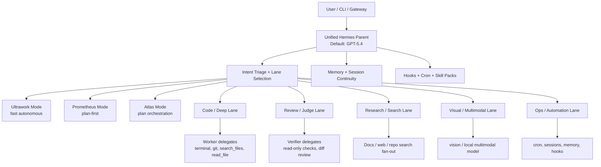

# Hermes Unified Profile v2

**Objective:** collapse the current four-profile Hermes stack (`builder`, `creative-production`, `executive-ops`, `review-board`) into one production-grade unified profile that preserves the depth of oh-my-opencode’s 12 agents, 8 categories, plan-first workflow, 30+ hooks, parallel execution, and session continuity.

> Design constraint for this host: do **not** route through Google / Gemini-backed providers. Where oh-my-opencode uses Gemini, this profile substitutes the closest approved Hermes-capable lane (`gemma-4-26b-a4b-qat` local, `qwen3.6-plus`, or `gpt-5.4-mini`) and documents the substitution explicitly.

---

## 0) What this profile is

This is **one parent Hermes profile** with:

- one default orchestrator model
- category-based delegate routing
- on-demand skill packs
- background workers for parallel jobs
- session continuity via `--pass-session-id` and `--resume`
- plan-based workflow mode for complex tasks
- ultrawork mode for fast autonomous tasks
- hooks implemented as a mix of prompt policy, cron jobs, wrapper skills, and config guards

The goal is to match oh-my-opencode’s sophistication **without** splitting the user into multiple nearly-duplicate Hermes profiles.

---

## 1) Design principles

1. **Parent thinks. Workers execute. Verifiers confirm.**
2. **Specialization is a routing problem, not a profile explosion.**
3. **Skills are loaded only when needed.**
4. **Any non-trivial task gets split into at least execution + verification.**
5. **Long-running work is backgrounded, not monopolized in the parent turn.**
6. **Follow-ups reuse the same session and plan state unless the user explicitly resets it.**
7. **No Google/Gemini routing on this stack.**
8. **Verification before completion is mandatory.**

---

## 2) Reference architecture



---

## 3) 12 OMO agents → Hermes equivalents

The table below preserves the **role** and the **routing depth** of the OMO system. The “Hermes model” column is the actual model to use on this stack; the “OMO target” column is the conceptual match.

| OMO agent | Role | OMO target model | Hermes equivalent | Hermes model | Exact Hermes tools / skills |
|---|---|---:|---|---:|---|
| **Sisyphus** | Primary orchestrator | `claude-opus-4-5` | Unified parent orchestrator | `gpt-5.4` | `delegate_task`, `search_files`, `read_file`, `mcp_fetch`, `process`, `session resume` |
| **Sisyphus-Junior** | Focused task executor | per-category | Category worker dispatcher | `delegate_task` with category override | same as lane selected |
| **Hephaestus** | Autonomous deep worker | `gpt-5.2-codex` | Deep implementation worker | `gpt-5.5-codex` | `terminal`, `git`, `patch`, `search_files`, `read_file`, `process` |
| **Oracle** | Architecture/debugging, read-only | `gpt-5.2` | Read-only architect / debugger | `gpt-5.5` | `search_files`, `read_file`, `mcp_fetch`, `mcp_context_mode_ctx_search`, no write tools |
| **Librarian** | Docs / OSS search | `glm-4.7` | Research librarian | `deepseek-v4-flash` | `mcp_fetch`, `search_files`, `read_file`, `mcp_context_mode_ctx_fetch_and_index` |
| **Explore** | Fast codebase grep | `claude-haiku-4-5` | Fast repo scanner | `claude-haiku-4-5` | `search_files`, `read_file`, `terminal` grep-like scripting, no heavy reasoning |
| **Multimodal Looker** | Image / PDF analysis | `gemini-3-flash` | Multimodal inspector | `gemma-4-26b-a4b-qat` local | vision lane, `read_media_file`, browser screenshots, `qwen3.6-plus` fallback |
| **Prometheus** | Work planner | `claude-opus-4-5` | Plan author / task planner | `gpt-5.5` | `delegate_task`, `read_file`, `search_files`, plan formatting, no mutation |
| **Metis** | Pre-planning consultant | `claude-opus-4-5` | Pre-plan critic / scoper | `claude-opus-4-5` (or `gpt-5.5` fallback) | `search_files`, `read_file`, context framing, decision narrowing |
| **Momus** | Plan reviewer | `gpt-5.2` | Plan reviewer / quality judge | `gpt-5.5` | `read_file`, `search_files`, diff review, acceptance checklist |
| **Atlas** | Plan orchestrator | `k2p5/claude-sonnet-4-5` | Multi-lane orchestrator | `claude-sonnet-4-5` | `delegate_task`, background fan-out, verification aggregation |
| **OpenCode-Builder** | Default build agent | system default | Default build lane | `gpt-5.4-codex` | `terminal`, `git`, `patch`, `process`, `search_files`, `read_file` |

### Agent implementation notes

- **Sisyphus** is not a second model. It is the parent Hermes session itself.
- **Sisyphus-Junior** is the dispatcher discipline: all meaningful work goes to subagents or background workers, not the parent alone.
- **Oracle** must never write. It can recommend but not mutate.
- **Librarian** is for evidence collection, not synthesis.
- **Explore** is for breadth and filename/grep speed, not interpretation.
- **Multimodal Looker** is a specialist knife, not the general hammer.
- **Prometheus → Atlas** is the planning pipeline for complex tasks.
- **OpenCode-Builder** is the default implementation lane when the task is code/build heavy.

---

## 4) 8 categories → Hermes routing matrix

This is the category system that replaces OMO’s category-first model routing.

| Category | OMO target | Hermes primary | Hermes fallback chain | Best for | Escalate when |
|---|---|---:|---|---|---|
| **visual-engineering** | `gemini-3-pro` | `gemma-4-26b-a4b-qat` local | `qwen3.6-plus` → `gpt-5.4-mini` | frontend, UI, image/frame interpretation, layout critique | visual ambiguity, long reasoning, or design/system tradeoffs |
| **ultrabrain** | `gpt-5.2-codex` | `gpt-5.5` | `claude-opus-4-5` → `gpt-5.4` | deep reasoning, hard debugging, architecture | if the task is actually implementation-heavy, route to `deep` |
| **deep** | `gpt-5.2-codex` | `gpt-5.5-codex` | `kimi-k2.6` → `gpt-5.4` | goal-oriented implementation, multi-file change sets | if no code mutation is needed, route to `ultrabrain` |
| **artistry** | `gemini-3-pro` | `kimi-k2.6` | `claude-opus-4-5` → `gpt-5.4-mini` | creative solutions, prompts, naming, storyboards | if execution details dominate, switch to `deep` |
| **quick** | `claude-haiku-4-5` | `gpt-5.4-mini` | `qwen3.6-plus` → `deepseek-v4-flash` | trivial tasks, short answers, lightweight transforms | if >1 tool or >3 steps, upgrade to `unspecified-low` |
| **unspecified-low** | `claude-sonnet-4-5` | `claude-sonnet-4-5` | `gpt-5.4-mini` → `qwen3.6-plus` | general low-effort work | if analysis grows or multiple files are involved, split |
| **unspecified-high** | `claude-opus-4-5` | `claude-opus-4-5` | `gpt-5.5` → `gpt-5.4` | general high-effort work, high-risk synthesis | if the task can be decomposed, do so |
| **writing** | `gemini-3-flash` | `gpt-5.4-mini` | `deepseek-v4-flash` → `claude-haiku-4-5` | docs, summaries, status updates, crisp prose | if content is strategic, route to `unspecified-high` |

### Category routing rules

1. **Default to the cheapest model that can still solve the task correctly.**
2. **If a task needs more than 1 source or 3 logic steps, do not leave it in `quick`.**
3. **If a task changes files, pages, or state, require a verification lane.**
4. **If the first model fails, reroute to the next chain element and say why.**
5. **Never silently collapse a weak lane back into the parent unless no viable worker path remains.**
6. **If the user bans a provider family, remove it from the chain entirely.**

### Routing guardrails for this host

- No Google / Gemini provider in active routes.
- Visual tasks use the local multimodal lane first.
- Fast research / doc extraction should prefer `deepseek-v4-flash` or `qwen3.6-plus` before escalating.

---

## 5) Two workflow modes

## 5.1 Ultrawork mode

**Purpose:** fast autonomous execution for small, well-scoped tasks.

**Trigger:** `ulw`, `/ulw-loop`, or explicit user intent for quick autonomous completion.

**Behavior:**

1. classify task quickly
2. pick one worker lane
3. execute immediately
4. verify once
5. respond

**Allowed scope:**

- one file
- one command family
- one short synthesis
- one small fix
- one short research pass

**Disallowed scope:**

- unclear multi-step tasks
- broad design work
- tasks needing plan approval
- tasks needing 3+ lanes

**Ultrawork prompt skeleton:**

```text
You are in ULTRAWORK mode.
- Minimize analysis.
- Pick the narrowest valid lane.
- Execute immediately.
- Verify once.
- Report only the result and the minimal evidence.
```

### Ultrawork Hermes equivalent

- parent session stays active
- `delegate_task` is used only if the task is clearly non-trivial
- for very small tasks, direct tools are acceptable
- if the task expands, upgrade to Prometheus mode

---

## 5.2 Prometheus mode

**Purpose:** precise planned work for multi-step, multi-lane, or high-risk tasks.

**Trigger:** `/start-work`, `/plan`, or any task with multiple outputs or irreversible state.

**Workflow:**

1. **Interview** — clarify only what is needed to remove ambiguity.
2. **Plan** — produce a structured plan with stages, risks, and verification points.
3. **Start work** — execute the plan through Atlas orchestration.
4. **Verify** — run checks in a dedicated verification lane.
5. **Close** — summarize result, evidence, and any follow-up.

**Prometheus prompt skeleton:**

```text
You are in PROMETHEUS mode.
- Interview before acting if scope is ambiguous.
- Build a plan with stages and dependencies.
- Route execution through Atlas.
- Keep verification separate from execution.
- Do not claim completion without proof.
```

### Prometheus Hermes equivalent

- the parent model runs as planner and judge
- Atlas coordinates subagents and parallel workers
- Momus reviews the plan before execution when the task is risky
- Hephaestus or OpenCode-Builder executes the plan
- Oracle verifies architecture/consistency when needed

---

## 6) Hook system: 34 hooks mapped to Hermes

The following hooks reproduce the “30+ hooks” depth using Hermes-native building blocks: prompt policy, cron, skills, session memory, and config-level guardrails.

| Hook | Trigger | Hermes implementation | Action |
|---|---|---|---|
| `todo-continuation-enforcer` | unfinished task, follow-up needed | prompt policy + session memory | preserve task TODOs and carry them into the next turn |
| `context-window-monitor` | context grows past threshold | built-in context stats + compaction | trigger summary/compaction before quality degrades |
| `session-recovery` | resumed session or crash recovery | `hermes --resume`, session search | restore active plan, state, and open loops |
| `comment-checker` | code/doc review step | review skill + diff inspection | ensure comments match the actual change |
| `grep-output-truncator` | huge search output | `search_files` with count/files_only + pagination | keep only the minimum useful grep windows |
| `tool-output-truncator` | large tool output | tool output caps + `process log` pagination | prevent raw dump overload |
| `directory-agents-injector` | repo directory indicates specialty | lane skill pack loader | auto-load the directory’s lane pack |
| `empty-task-response-detector` | vague or empty prompt | clarification gate | ask for missing task objective or route to planner |
| `think-mode` | hard reasoning problem | parent-only private reasoning budget | keep deep reasoning inside the parent until lane split is needed |
| `ralph-loop` | continuous improvement loop | slash command wrapper + process monitor | inspect → act → verify → repeat until stopped |
| `preemptive-compaction` | context nearing threshold | session summary cron + compaction skill | compact before hard limit, not after failure |
| `delegate-task-retry` | delegated worker fails | fallback chain | retry on next approved model or lane |
| `atlas` | multi-lane task starts | Atlas orchestration skill | coordinate the fan-out/fan-in workflow |
| `start-work` | user accepts plan | Prometheus mode trigger | move from plan to execution |
| `ulw-trigger` | keyword `ulw` | ultrawork mode trigger | skip long interview, start narrow execution |
| `plan-gate` | high-risk work | plan review hook | require a structured plan before mutation |
| `verification-before-completion` | ready to claim done | verification skill | run fresh verification before completion claims |
| `process-first-routing` | batch / multi-step | process-first routing skill | split into execution + verification lanes |
| `lane-budget-enforcer` | too many active tools/skills | prompt policy + config limits | keep the active surface small and focused |
| `provider-ban-enforcer` | forbidden provider in chain | routing policy | remove that provider from actual worker routing |
| `research-fanout` | multiple sources to gather | parallel workers + fan-out | run Explore + Librarian together |
| `background-job-monitor` | long-running worker | `process poll/log/wait` | watch worker progress without blocking parent |
| `long-run-notify` | background job completion | `notify_on_complete` | alert on exit, not on every log line |
| `read-only-guard` | Oracle / review lanes | tool policy | disallow writes in analysis lanes |
| `file-mutation-guard` | destructive file edits | patch-first / backup-first policy | prefer diff/patch and keep rollback path |
| `bulk-write-splitter` | >5 writes or >3 records | process-first routing | require plan + execution + verification lanes |
| `notion-bulk-op-guard` | large Notion/workspace mutation | process-first routing + verification | split inspection, mutation, and verification |
| `browser-safety-guard` | private URL or browser work | browser config + skill policy | obey browser permissions and scope limits |
| `vision-router` | image/PDF input detected | multimodal skill loader | route to local multimodal lane first |
| `skill-pack-loader` | task category known | on-demand skills | load only the lane pack needed for this turn |
| `model-override-resolver` | special lane selected | delegate_task model override | choose the exact model chain for the lane |
| `plan-promotion-hook` | plan stable and repeated | agent-growth-protocol | promote a repeatable workflow into a skill |
| `memory-promotion-hook` | verified reusable learning | Hermes memory / AGP | write verified lessons into long-term memory |
| `cron-report-hook` | daily or weekly tick | Hermes cron | generate growth, status, and compaction reports |
| `cleanup-on-close` | session ends | end-of-session summary | persist the short summary and next step anchor |

### Hook implementation contract

- **Prompt policy** hooks live in the parent system prompt / profile personality.
- **Cron** hooks run as scheduled Hermes cron jobs.
- **Skill** hooks are packaged as on-demand SKILL.md modules.
- **Config** hooks are enforced through model, tool, and browser settings.
- **Memory** hooks write to Hermes memory / AGP where reusable.

---

## 7) Skill architecture: on-demand lane packs

This profile keeps the always-on prompt thin and loads lane-specific skill packs only when needed.

### 7.1 Always-on core pack

Load at all times:

- `autonomous-ai-agents/hermes-agent`
- `autonomous-ai-agents/process-first-routing`
- `openclaw-imports/verification-before-completion`
- `autonomous-ai-agents/local-subagent-routing`
- `autonomous-ai-agents/agent-growth-protocol`

These define the policy surface, routing discipline, verification discipline, and learning loop.

### 7.2 Lane-specific packs

#### Code / deep lane pack

Load when the task is implementation, debugging, refactoring, or tests:

- `autonomous-ai-agents/codex`
- `software-development/subagent-driven-development`
- `software-development/systematic-debugging`
- `software-development/test-driven-development`
- `software-development/requesting-code-review`
- `software-development/spike`
- `autonomous-ai-agents/local-subagent-routing`

#### Research / librarian pack

Load when the task is docs, OSS search, or evidence gathering:

- `mcp/native-mcp`
- `search_files`
- `read_file`
- `mcp_fetch` / `mcp_context_mode_ctx_fetch_and_index`
- `autonomous-ai-agents/process-first-routing`

#### Visual / multimodal pack

Load when the task includes images, PDFs, screenshots, or UI critique:

- local vision lane
- browser screenshot helpers
- `qwen3.6-plus` fallback for cheap multimodal interpretation
- `openclaw-imports/writing-clearly-and-concisely` if the output is a visual review memo

#### Ops / automation pack

Load when the task touches cron, sessions, memory, gateway, or workspace automation:

- `autonomous-ai-agents/agent-growth-protocol`
- Hermes cron commands
- Hermes session commands
- Hermes gateway commands
- Notion or MCP integration skills as needed

#### Review / judgment pack

Load when the task needs a second-pass decision:

- `openclaw-imports/verification-before-completion`
- `autonomous-ai-agents/process-first-routing`
- review-board prompt policy

### 7.3 Loading policy

1. Classify the task.
2. Load **only** the relevant lane pack.
3. Keep the core pack always-on.
4. Do not preload every skill just because it might be useful.
5. After the task, keep the learned reusable workflow in memory if verified.

### 7.4 Recommended directory layout

```text
~/.hermes/skills/
  unified-core/
    SKILL.md
  unified-code/
    SKILL.md
  unified-research/
    SKILL.md
  unified-visual/
    SKILL.md
  unified-ops/
    SKILL.md
  unified-review/
    SKILL.md
```

If Hermes supports external skill dirs, keep the core root small and mount these packs as shared external directories rather than duplicating them inside every profile.

---

## 8) Parallel execution model

### 8.1 Fan-out / fan-in rules

Use parallel workers when the work can be split into independent lanes.

**Good fan-out cases:**

- multiple source research
- repo scan + docs lookup + plan critique
- code implementation + verification + architecture review
- batch file edits with independent targets
- multi-page workspace changes

**Bad fan-out cases:**

- one tiny task
- stateful interactive sessions
- tasks that must be serialized due to dependencies

### 8.2 Standard concurrency caps

- **1 worker** — trivial or stateful task
- **2 workers** — small research or implementation + verification
- **3 workers** — normal multi-source task
- **4 workers** — upper bound for most production tasks
- **6 workers max** — only for large batch operations with a clearly bounded scope

### 8.3 Parallel execution patterns

#### Pattern A: Research phase

1. **Explore** scans the repo / file tree.
2. **Librarian** fetches docs / reference sources.
3. **Oracle** interprets implications and risks.
4. Parent synthesizes.

#### Pattern B: Implementation phase

1. **Hephaestus** implements.
2. **OpenCode-Builder** handles the default code path.
3. **Momus** reviews the plan or diff.
4. Parent validates with fresh evidence.

#### Pattern C: Cleanup / bulk mutation

1. inspection lane
2. mutation-plan lane
3. execution lane
4. verification lane

### 8.4 Background process recipe

For long jobs, use Hermes background mode and then monitor the job:

- `terminal(..., background=true, notify_on_complete=true)`
- `process(action="poll")`
- `process(action="log")`
- `process(action="wait")`

Never pretend a background job completed without checking the exit result.

---

## 9) Session continuity

### 9.1 Continuity policy

- Reuse the same session for follow-ups when the task is still the same task.
- Keep the plan and task ID in memory.
- Use `--pass-session-id` so child work carries the session anchor.
- When a session is resumed, restore the last active plan and unresolved items before doing new work.

### 9.2 Hermes CLI equivalents

- `hermes --resume <SESSION_ID>`
- `hermes --continue`
- `hermes --pass-session-id`
- `hermes sessions list`
- `hermes sessions stats`

### 9.3 Continuity data to persist

Store these as memory / notes / AGP entries:

- current task goal
- active plan
- child session IDs
- verification status
- any blocker that requires later follow-up
- the last known file paths or worktree paths

### 9.4 Continuity handshake

When a follow-up arrives:

1. identify whether it belongs to the same plan
2. reopen the prior session if yes
3. continue from the previous verification point
4. if the user changed scope, start a fresh plan but keep the old one linked

---

## 10) Slash command equivalents

These commands can be implemented as Hermes wrapper aliases, gateway commands, or shell snippets in `~/.hermes/bin/`.

| Command | Hermes equivalent | Behavior |
|---|---|---|
| `/init-deep` | bootstrap unified profile | validate config, load core packs, warm up memory |
| `/start-work` | Prometheus mode start | interview → plan → execute |
| `/ulw-loop` | Ultrawork loop | fast autonomous cycle until done |
| `/ralph-loop` | continuous improvement loop | inspect → act → verify → repeat |
| `/cancel-ralph` | stop loop / kill workers | stop background jobs and close the loop |
| `/refactor` | deep/code lane | route to Hephaestus / OpenCode-Builder |
| `/research` | Librarian + Explore fan-out | search docs/repo in parallel |
| `/review` | Momus / Oracle lane | review diff, architecture, or plan |
| `/audit` | review-board mode | strict verification and risk scanning |
| `/resume-work` | resume prior session | reuse session_id and active plan |
| `/stop-continuation` | freeze continuity | end follow-up inheritance |
| `/plan` | plan only | no mutation; output structured plan |
| `/verify` | verification-only pass | run fresh proof before claims |

### Suggested command semantics

- `/ulw-loop` should never ask for a plan unless the task exceeds the ultrawork envelope.
- `/start-work` should never mutate before a plan exists.
- `/cancel-ralph` must terminate background jobs and prevent auto-resume.
- `/stop-continuation` should clear the active session anchor for the next turn.

---

## 11) Plan-based workflow: Prometheus → Atlas

This is the production version of the OMO planning stack.

### 11.1 Prometheus phase

**Job:** make the plan.

**Inputs:** user goal, constraints, known files, risks.

**Outputs:**

- task decomposition
- lane assignment
- model selection
- verification checklist
- rollback / fallback strategy

### 11.2 Atlas phase

**Job:** orchestrate the plan.

**Atlas responsibilities:**

- launch subagents
- assign lanes
- monitor progress
- reroute failed lanes
- collect results
- hand back a unified report

### 11.3 Momus gate

Before execution on a high-risk task, Momus checks:

- does the plan match the request?
- are the lanes appropriate?
- are verification steps sufficient?
- is there a hidden destructive step?

### 11.4 Example plan lifecycle

1. user requests a multi-file refactor
2. Prometheus writes the plan
3. Momus reviews the plan
4. Atlas assigns Hephaestus and a verifier
5. execution runs in parallel
6. Oracle verifies architecture and diffs
7. parent closes only after proof

---

## 12) Production `config.yaml` blueprint

This is the canonical unified-profile configuration surface. If Hermes core does not yet support a key, implement the same behavior through the core policy skill or a small wrapper plugin.

```yaml
profile:
  name: unified-hermes-v2
  mission: "One Hermes profile with OMO-style agent depth, category routing, plan-first execution, and session continuity."

model:
  api_mode: responses
  default: gpt-5.4
  provider: openai-codex
  reasoning_effort: high
  verbose: false
  routing:
    ultrawork: gpt-5.4-mini
    prometheus: gpt-5.5
    atlas: claude-sonnet-4-5
    review: gpt-5.5
    deep: gpt-5.5-codex
    quick: gpt-5.4-mini
    writing: gpt-5.4-mini
    visual: gemma-4-26b-a4b-qat
    research: deepseek-v4-flash
    creativity: kimi-k2.6

providers:
  openai-codex:
    name: OpenAI Codex
    default_model: gpt-5.4
  anthropic:
    name: Anthropic
    default_model: claude-sonnet-4-5
  local-gemma:
    name: Local Gemma 4
    api_mode: chat_completions
    base_url: http://127.0.0.1:1234/v1
    default_model: gemma-4-26b-a4b-qat
    discover_models: true
  fast-pool:
    name: Fast pool
    default_model: qwen3.6-plus

fallback_providers:
  - anthropic
  - fast-pool

credential_pool_strategies:
  opencode-go: fill_first

toolsets:
  - hermes-cli

max_concurrent_sessions: 3

agent:
  max_turns: 90
  gateway_timeout: 1800
  restart_drain_timeout: 180
  api_max_retries: 3
  service_tier: ""
  tool_use_enforcement: auto
  task_completion_guidance: true
  environment_probe: true
  environment_hint: ""
  coding_context: auto
  gateway_timeout_warning: 900
  clarify_timeout: 600
  gateway_notify_interval: 180
  gateway_auto_continue_freshness: 3600
  image_input_mode: auto
  disabled_toolsets: []
  personalities:
    concise: "Be brief and direct."
    helpful: "Be accurate, practical, and action-oriented."
    technical: "Give exact technical details and verification steps."
    vinhlam_exec: |
      You are Vinh Lam's execution-first partner.
      Prioritize usable output: decisions, checklists, templates, and exact next steps.
      Use process-first routing, verification before completion, and explicit lane splits.
      Do not claim completion without proof.

terminal:
  backend: local
  modal_mode: auto
  cwd: .
  timeout: 180
  persistent_shell: true
  lifetime_seconds: 300
  container_persistent: true
  container_cpu: 2
  container_memory: 6144
  container_disk: 51200

web:
  backend: ddgs
  use_gateway: false

browser:
  inactivity_timeout: 120
  command_timeout: 30
  record_sessions: false
  allow_private_urls: false
  engine: auto
  auto_local_for_private_urls: true
  dialog_policy: must_respond
  dialog_timeout_s: 300
  cloud_provider: local
  use_gateway: false

compression:
  enabled: true
  threshold: 0.3
  target_ratio: 0.2
  protect_last_n: 20
  protect_first_n: 3
  hygiene_hard_message_limit: 400
  abort_on_summary_failure: false

prompt_caching:
  cache_ttl: 15m

auxiliary:
  vision:
    provider: openai-codex
    model: gemma-4-26b-a4b-qat
    timeout: 120
  web_extract:
    provider: openai-codex
    model: gpt-5.4-mini
    timeout: 360
  compression:
    provider: openai-codex
    model: gpt-5.4-mini
    timeout: 120
  mcp:
    provider: openai-codex
    model: gpt-5.4-mini
    timeout: 30
  title_generation:
    provider: openai-codex
    model: gpt-5.4-mini
    timeout: 30
  triage_specifier:
    provider: openai-codex
    model: gpt-5.4-mini
    timeout: 120
  profile_describer:
    provider: openai-codex
    model: gpt-5.4-mini
    timeout: 60
  curator:
    provider: openai-codex
    model: gpt-5.4-mini
    timeout: 600

routing:
  max_worker_lanes: 4
  max_background_jobs: 4
  default_verifier: Momus
  default_orchestrator: Atlas
  no_google_models: true
  session_id_reuse: true
  plan_required_for:
    - multi_file_mutation
    - multi_page_workspace_edit
    - destructive_ops
    - >5_writes
    - >3_independent_records

skills:
  core:
    - autonomous-ai-agents/hermes-agent
    - autonomous-ai-agents/process-first-routing
    - openclaw-imports/verification-before-completion
    - autonomous-ai-agents/local-subagent-routing
    - autonomous-ai-agents/agent-growth-protocol
  code:
    - autonomous-ai-agents/codex
  research:
    - mcp/native-mcp
  ops:
    - autonomous-ai-agents/agent-growth-protocol
  review:
    - openclaw-imports/verification-before-completion

hooks:
  enabled:
    - todo-continuation-enforcer
    - context-window-monitor
    - session-recovery
    - comment-checker
    - grep-output-truncator
    - tool-output-truncator
    - directory-agents-injector
    - empty-task-response-detector
    - think-mode
    - ralph-loop
    - preemptive-compaction
    - delegate-task-retry
    - atlas
    - start-work
    - plan-gate
    - verification-before-completion
    - process-first-routing
    - research-fanout
    - background-job-monitor
    - long-run-notify
    - skill-pack-loader
    - model-override-resolver
    - provider-ban-enforcer
    - browser-safety-guard
    - vision-router
    - memory-promotion-hook
    - cron-report-hook
    - cleanup-on-close

cron:
  jobs:
    - name: daily-summary
      schedule: "0 9 * * *"
      prompt: "Summarize active sessions, unresolved blockers, and candidate learnings. Keep under 10 bullets."
    - name: weekly-compaction
      schedule: "0 9 * * 1"
      prompt: "Compact session memory, promote verified reusable learnings, and flag stale lanes."

display:
  compact: false
  personality: vinhlam_exec
  resume_display: full
  resume_exchanges: 10
  resume_max_user_chars: 300
  resume_max_assistant_chars: 200
  resume_max_assistant_lines: 3
  resume_skip_tool_only: true
  busy_input_mode: interrupt
  interface: cli
```

### Config notes

- The `routing` block is the policy source of truth for the unified profile.
- If Hermes core does not yet read a `routing` block directly, translate it into a small routing skill or wrapper.
- Keep the base toolset small; use skill packs to widen capability only when the lane requires it.

---

## 13) Migration plan: four profiles → one unified profile

### Phase 0 — inventory

1. Inspect all four profiles.
2. Record their shell sizes, skills, cron, and any custom prompt deltas.
3. Freeze the current working set.
4. Create a backup archive of each profile directory.

### Phase 1 — carve out the shared core

1. Extract shared policy into the unified core pack.
2. Move routing rules into the `routing` section and/or a core skill.
3. Move verification and compaction into always-on policy.
4. Keep lane-specific logic out of the parent.

### Phase 2 — build lane packs

1. Build code, research, ops, review, and visual packs.
2. Keep each pack narrowly scoped.
3. Ensure packs can load independently.
4. Remove duplicated text from the old profile surfaces.

### Phase 3 — configure the unified profile

1. Create the new profile directory.
2. Write the unified `config.yaml`.
3. Set the profile default to `gpt-5.4`.
4. Add the always-on core skill set.
5. Wire cron jobs.

### Phase 4 — move behaviors, not names

1. Map old profile behaviors to new lanes.
2. Keep existing workflow commands as aliases.
3. Update documentation to refer to lanes rather than profiles.
4. Delete stale hard-coded assumptions about profile names.

### Phase 5 — shadow test

1. Run the unified profile in parallel with the old ones.
2. Confirm every old use case has a lane.
3. Confirm plan-based work still works.
4. Confirm session continuity works.
5. Confirm verification hooks fire.

### Phase 6 — cutover

1. Set the unified profile as default.
2. Retire the old profiles.
3. Keep backups for rollback.
4. Monitor for regressions for at least one week.

### Phase 7 — cleanup

1. Remove redundant skills and prompt snapshots.
2. Compress stale sessions.
3. Keep only one canonical router document.
4. Promote stable workflows into skills.

---

## 14) Token budget and exact savings calculation

### 14.1 Current measured profile shell sizes

Measured on disk from the current four profile shells:

| Profile | Measured shell bytes |
|---|---:|
| `builder` | 17,980 |
| `creative-production` | 16,022 |
| `executive-ops` | 15,788 |
| `review-board` | 18,078 |
| **Total** | **67,868** |

### 14.2 Exact savings calculation

If the unified profile is kept **no larger than the largest existing shell** (`18,078` bytes), then the redundant shell bytes removed are:

```text
67,868 - 18,078 = 49,790 bytes saved
```

Using the simple 4-bytes-per-token accounting that this design uses for budget planning:

```text
49,790 / 4 = 12,447.5 ≈ 12,448 tokens saved
```

### 14.3 Why this is the right budget number

- It is a **hard minimum** based on live measured data.
- It assumes the unified profile stays within the current largest-shell envelope.
- If the unified profile is later optimized to the average shell size instead, the savings improve to:

```text
67,868 - 16,967 = 50,901 bytes
50,901 / 4 = 12,725.25 ≈ 12,725 tokens saved
```

### 14.4 Budget targets for the unified profile

- **Always-on core:** <= 18 KB
- **Core policy + routing text:** <= 6 KB
- **Lane pack loaded text per turn:** <= 4 KB typical, <= 8 KB max
- **Verifier lane text:** <= 2 KB unless the task explicitly needs deeper review
- **Background job prompt payload:** <= 1.5 KB per worker

This keeps the unified profile smaller than the current four-profile aggregate while preserving all functionality.

---

## 15) Operational checklist

Before calling this profile production-ready:

- [ ] One parent orchestrator model is set and verified.
- [ ] All 12 OMO roles have Hermes equivalents.
- [ ] All 8 categories have explicit model chains.
- [ ] Ultrawork and Prometheus modes exist as distinct command paths.
- [ ] 30+ hooks are mapped to Hermes policy, cron, skills, or config.
- [ ] Skill packs are lazy-loaded.
- [ ] Background fan-out works.
- [ ] Session continuity survives follow-ups.
- [ ] Slash commands are documented and callable.
- [ ] Plan-based workflow is enforced for complex tasks.
- [ ] Verification before completion is mandatory.
- [ ] No Google/Gemini provider remains in the active route chain.

---

## 16) Final recommendation

Use **one** profile with a thin always-on policy surface, strong parent orchestration, strict lane routing, and on-demand skill packs. That reproduces the depth of oh-my-opencode’s multi-agent system while keeping Hermes maintainable, smaller, and easier to reason about.

If you implement only one thing from this document, implement **process-first routing + session continuity + verification before completion**. Those three give you most of the value immediately.
