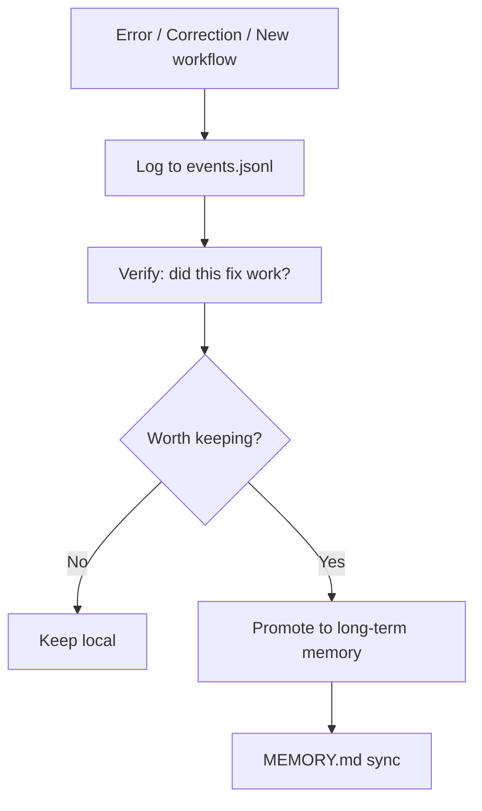

# Agent Growth Protocol v0.3.1

**Make Hermes remember what actually matters.**
**Biến lỗi lặp lại thành bài học hữu ích — sạch, có cấu trúc, và dùng lại được.**

---

## What it does

Most AI agents forget everything between sessions. They repeat the same mistakes, burn credits fixing solved problems, and never improve.

AGP captures tool errors, user corrections, and useful workflows. It stores them in a structured log, verifies what is worth keeping, and promotes only high-value learnings into long-term memory.

**Result:** fewer repeated mistakes, better recall, cleaner memory.

> VN: Agent hay quên between sessions. AGP ghi lại lỗi, cách fix, và workflow hay. Chỉ bài học đã kiểm chứng mới được đẩy vào long-term memory.

---

## Who this is for

- Hermes users who want better agent memory behavior
- AI developers building agent workflows
- Teams that want structured learning from repeated tool errors

> VN: Dành cho người dùng Hermes muốn agent nhớ đúng thứ cần nhớ, và dev AI muốn agent tự học từ lỗi.

---

## Quick install

```bash
curl -fsSL https://raw.githubusercontent.com/roverdude24/agent-growth-protocol/main/install.sh | bash
```

This clones the repo, copies the skill to Hermes, installs the helper script, and generates your first report.

> VN: Một dòng là xong — clone repo, cài skill, cài script, tạo report.

### What gets installed

```text
~/.hermes/memories/agent_growth/events.jsonl    ← structured event database
~/.hermes/memories/AGENT_GROWTH.md             ← human-readable report
~/.hermes/scripts/agent_growth.py              ← CLI helper
~/.hermes/skills/.../agent-growth-protocol/SKILL.md  ← agent instructions
```

### Verify

```bash
python3 ~/.hermes/scripts/agent_growth.py report
```

You should see event counts and a clean summary.

---

## Quick commands

### Slash commands (one word)

| Command | What it does |
|---|---|
| `/agp-learn` | Record a learning event |
| `/agp-grow` | Record a new capability |
| `/agp-checkpoint` | Save current task state |
| `/agp-report` | Show stats and status |
| `/agp-compact` | Clean stale entries |
| `/agp-sync` | Push verified rules to long-term memory |

### CLI commands (copy-paste)

```bash
# Log a learning
python3 ~/.hermes/scripts/agent_growth.py add-learning \
  --topic "tool:write_file" \
  --impact high \
  --problem "Root config is protected from patch" \
  --fix "Use hermes config set for root config edits"

# Log a growth event
python3 ~/.hermes/scripts/agent_growth.py add-growth \
  --topic "workflow:config-patch" \
  --capability "Can audit and patch multi-profile Hermes configs" \
  --evidence "Fixed default, review-board, creative, executive profiles"

# Save checkpoint
python3 ~/.hermes/scripts/agent_growth.py checkpoint \
  --task "Mirror MV prompt system" \
  --decisions "Two-track Character/Vehicle workflow" \
  --blockers "Need source footage" \
  --next "Generate prompt packets"

# Verify a learning
python3 ~/.hermes/scripts/agent_growth.py verify --id LRN-001 \
  --evidence "Applied successfully in next session"

# Report
python3 ~/.hermes/scripts/agent_growth.py report

# Compact stale entries
python3 ~/.hermes/scripts/agent_growth.py compact

# Sync verified rules to long-term memory
python3 ~/.hermes/scripts/agent_growth.py sync-mnemosyne
```

> VN: Gõ `/agp-learn` trong chat hoặc chạy CLI thủ công. Agent tự đọc skill để gọi script khi có lỗi.

---

## How it works



**Rule:** only verified, reusable, high-value learnings enter long-term memory. Raw errors stay local.

> VN: Dữ liệu thô giữ trong event store. Chỉ bài học đã kiểm chứng mới được sync vào long-term memory.

---

## Auto-capture rules

When the AGP skill is loaded, the agent self-triggers on these events:

| Event | Agent does |
|---|---|
| Tool returns error | Logs a learning |
| User corrects the agent | Logs a learning |
| Agent retries same tool 2+ times | Logs a learning |
| Workaround discovered | Logs a learning |
| New workflow completed | Logs a growth event |
| Context > 70% | Creates a checkpoint |
| Learning reused successfully | Marks it verified |

> VN: Agent tự gọi script khi có sự kiện. User không cần gõ gì cả.

---

## Topic naming convention

Prefix topics to keep the database clean:

| Prefix | Use for |
|---|---|
| `hermes-config:` | Configuration errors |
| `tool:` | Tool-specific failures |
| `workflow:` | Multi-step procedures |
| `project:` | Project-specific learnings |

---

## What gets promoted

AGP promotes only when ALL true:

- `status=verified` (confirmed working)
- `seen >= 3` (repeatedly useful)
- `confidence >= 0.8` (high confidence)
- `impact = medium or high`

| Learning type | Destination |
|---|---|
| User preference | `USER.md` |
| Operating rule | `POLICY.md` or `SOUL.md` |
| Repeatable workflow | Hermes skill |
| Tool pitfall | Skill Pitfalls section |
| One-off workaround | Stays in event store |

> VN: Không đẩy lỗi thô vào config. Chỉ promote khi đã kiểm chứng.

---

## Automation levels

| Level | How | Status |
|---|---|---|
| 1 | Agent reads skill, self-triggers | Active (best-effort) |
| 2 | CLI helper script | Active & reliable |
| 3 | Cron job for daily report/compact | Active (if configured) |
| 4 | Native shell hooks | Future work |

> VN: Level 1-3 hoạt động ngay. Level 4 là tương lai.

---

## Strengths

- Keeps `USER.md` clean for user preferences only
- Keeps `MEMORY.md` lean and high-signal
- Structured JSONL log for easy search and analysis
- Verified-only promotion prevents memory pollution
- One-line install, zero setup

## Weaknesses

- No native shell hooks yet (auto-capture is prompt-dependent)
- Compaction is rule-based, not semantic
- Promotion needs human approval
- Some sections still assume Hermes familiarity

---

## Compatibility

- Hermes Agent (any version with skill support)
- macOS / Linux shell
- Python 3 installed
- Git + curl available

---

## Troubleshooting

**Install fails:**
1. Check Python 3: `python3 --version`
2. Check Hermes: `hermes --version`
3. Check `~/.hermes/` exists
4. Run install manually: `cd /path/to/repo && ./install.sh`
5. Check report: `python3 ~/.hermes/scripts/agent_growth.py report`

**Events not logging:**
- Check skill is loaded: `hermes skills list | grep agent-growth`
- Check script exists: `ls ~/.hermes/scripts/agent_growth.py`

**Sync not working:**
- Run `report` first to verify events exist
- Only verified + high-confidence entries sync

> VN: Nếu install fail, check Python 3 và Hermes trước. Nếu sync không hoạt động, chạy report kiểm tra.

---

## FAQ

**Is this only for Hermes?**
The CLI helper works with any agent that can run shell commands. The skill file is Hermes-specific.

**Does it overwrite my memory?**
No. It only appends to `events.jsonl` and generates `AGENT_GROWTH.md`. Existing files in `USER.md`, `MEMORY.md` are not modified by the learning loop.

**Can I uninstall safely?**
Yes. Remove these files:
```bash
rm -rf ~/.hermes/memories/agent_growth
rm ~/.hermes/memories/AGENT_GROWTH.md
rm ~/.hermes/scripts/agent_growth.py
rm -rf ~/.hermes/skills/autonomous-ai-agents/agent-growth-protocol
```

**What about privacy?**
All data stays local in `~/.hermes/`. No external API calls. No telemetry.

> VN: Mọi dữ liệu đều cục bộ. Không gọi API ngoài. An toàn.

---

## Origin

Adapted from [AI Persona OS](https://clawhub.ai/jeffjhunter/ai-persona-os), focused on operational learning and memory for Hermes agents.

## License

MIT
