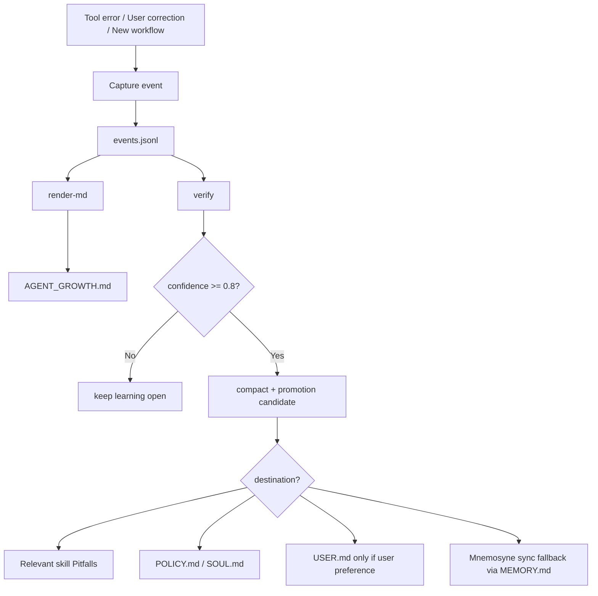

# Agent Growth Protocol

**Make Hermes remember what actually matters.**

Agent Growth Protocol turns repeated mistakes into verified rules, tracks new capabilities, and syncs high-value learnings back into Hermes long-term memory without polluting `USER.md` or the main `MEMORY.md`.

> VN: Biến lỗi lặp lại thành bài học đã kiểm chứng. Giữ bộ nhớ Hermes sạch, có cấu trúc, và hữu ích lâu dài.

---

## Why this exists

Most agent memory becomes messy:

- one-off tool errors
- duplicated fixes
- stale checkpoints
- random notes mixed with user preferences

This repo gives Hermes a simple learning pipeline:

```text
error / correction / new workflow
        ↓
events.jsonl               # source of truth
        ↓
AGENT_GROWTH.md            # human-readable report
        ↓
verify + compact + promote
        ↓
Mnemosyne / MEMORY.md sync # long-term recall
```

VN: Không ghi mọi thứ vào long-term memory. Chỉ sync những bài học đã kiểm chứng, có ích cho các session sau.

---

## Quick install

### One-line install

```bash
curl -fsSL https://raw.githubusercontent.com/roverdude24/agent-growth-protocol/main/install.sh | bash
```

This is the shortest path today — basically the “`hermes install agent-growth-protocol`” experience until Hermes supports direct GitHub skill install.

VN: Một dòng là xong: clone repo, copy skill, cài script, tạo report.

### Manual install

```bash
git clone https://github.com/roverdude24/agent-growth-protocol.git
cd agent-growth-protocol
./install.sh
```

Verify:

```bash
hermes skills list | grep agent-growth
python3 ~/.hermes/scripts/agent_growth.py report
```

---

## Files

```text
~/.hermes/memories/agent_growth/events.jsonl   # structured source of truth
~/.hermes/memories/AGENT_GROWTH.md            # generated report for humans
~/.hermes/scripts/agent_growth.py             # CLI helper
~/.hermes/skills/autonomous-ai-agents/agent-growth-protocol/SKILL.md
```

VN:
- `events.jsonl`: dữ liệu thật để máy xử lý
- `AGENT_GROWTH.md`: bản đọc dễ hiểu cho người
- `agent_growth.py`: công cụ thêm/sync/compact/report

---

## How it works



Key principle:

```text
Raw events stay local.
Verified high-value lessons become long-term memory.
```

VN: Dữ liệu thô giữ trong event store. Chỉ bài học đã kiểm chứng mới được sync vào long-term memory.

---

## Commands

### Add a learning

```bash
python3 ~/.hermes/scripts/agent_growth.py add-learning \
  --topic hermes-config \
  --impact high \
  --problem 'Root config is protected from patch/write_file' \
  --fix 'Use hermes config set for root config edits'
```

### Add a growth event

```bash
python3 ~/.hermes/scripts/agent_growth.py add-growth \
  --topic hermes \
  --capability 'Can audit and patch multi-profile Hermes configs' \
  --evidence 'Fixed default, review-board, creative-production, executive-ops profiles'
```

### Checkpoint long work

```bash
python3 ~/.hermes/scripts/agent_growth.py checkpoint \
  --task 'Mirror MV prompt system' \
  --decisions 'Use two-track Character/Vehicle workflow' \
  --blockers 'Need final source footage' \
  --next 'Generate prompt packets'
```

### Verify a learning

```bash
python3 ~/.hermes/scripts/agent_growth.py verify \
  --id LRN-001 \
  --evidence 'Applied successfully in next Hermes config edit'
```

### Sync verified lessons into Hermes long-term memory

```bash
python3 ~/.hermes/scripts/agent_growth.py sync-mnemosyne
```

Current sync behavior:

- Direct Mnemosyne write tool is not available in this environment.
- The script writes a compact `## Agent Growth Sync` block into `~/.hermes/memories/MEMORY.md`.
- Hermes/Mnemosyne can then recall those high-value rules later.

### Report / compact / render

```bash
python3 ~/.hermes/scripts/agent_growth.py report
python3 ~/.hermes/scripts/agent_growth.py compact
python3 ~/.hermes/scripts/agent_growth.py render-md
python3 ~/.hermes/scripts/agent_growth.py promotions
```

---

## What gets synced to long-term memory?

Sync only if:

- learning is verified
- confidence >= 0.8 OR impact is high
- lesson is reusable across future sessions
- not just a one-off typo or transient API issue

Good sync:

```text
[AGENT_LEARNING] hermes-config: Root config is protected from patch/write_file → use hermes config set
```

Bad sync:

```text
[AGENT_LEARNING] I typed the wrong path once
```

VN: Sync ít nhưng chất. Đừng biến long-term memory thành thùng rác.

---

## Promotion rules

Promote only when all are true:

- `status=verified`
- `seen >= 3`
- `confidence >= 0.8`
- impact is `medium` or `high`
- rule is stable and reusable

Destination guide:

| Learning type | Destination |
|---|---|
| User preference | `USER.md` |
| Agent operating rule | `POLICY.md` or profile `SOUL.md` |
| Repeatable workflow | new or existing Hermes skill |
| Tool pitfall | relevant skill Pitfalls section |
| One-off workaround | keep in `events.jsonl` |

VN: Không đẩy lỗi thô vào `USER.md`. Chỉ promote khi đã kiểm chứng.

---

## Automation levels

| Level | Mechanism | Status |
|---|---|---|
| 1 | Skill instructions | Works, best-effort |
| 2 | `agent_growth.py` CLI | Works, reliable |
| 3 | Cron report/compact/sync | Works if scheduled |
| 4 | Hermes shell hooks | Future work |

Honest note: prompt-triggered automation depends on the agent remembering the skill. Reliable automation comes from script + cron. Full auto-capture needs Hermes hooks wired and tested.

---

## Strengths

- Keeps `USER.md` clean
- Keeps main `MEMORY.md` lean
- Uses JSONL as source of truth
- Generates readable markdown report
- Adds verification before promotion
- Supports Mnemosyne long-term sync fallback

## Weaknesses

- No native hook capture yet
- Compaction is rule-based, not semantic clustering
- Promotion still needs human approval
- Metrics are basic counts, not full error-rate analytics

---

## Roadmap

- Wire Hermes `post_tool_call` / `transform_tool_result` hooks
- Add semantic duplicate clustering
- Add `verify-learning` with success/failure scoring
- Add weekly cron template
- Add direct Mnemosyne write once API/tool exists

---

## Origin

Adapted from [AI Persona OS](https://clawhub.ai/jeffjhunter/ai-persona-os), narrowed for Hermes. This repo keeps only the operational parts: learning, verification, compaction, growth, and long-term memory sync.

## License

MIT
