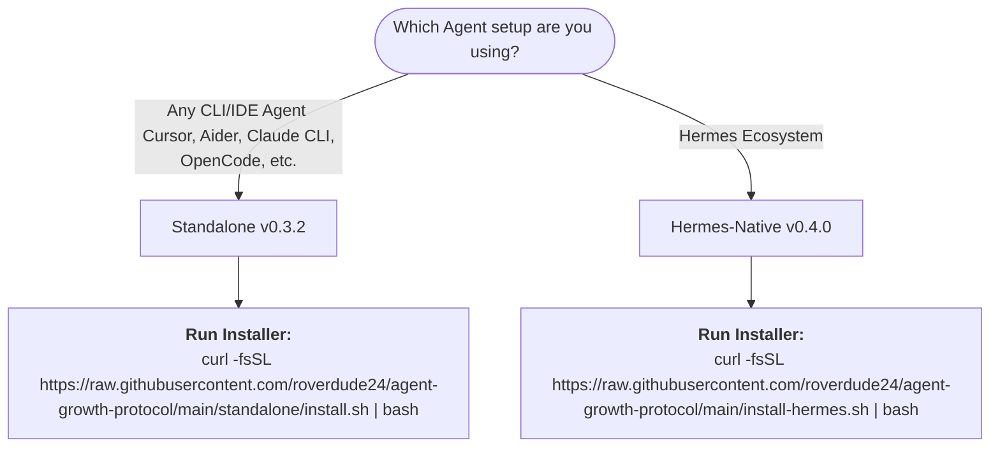
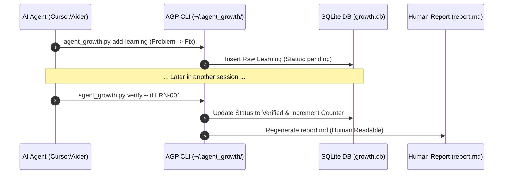
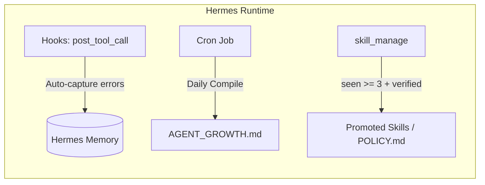

# Agent Growth Protocol (AGP) 📈

[](https://opensource.org/licenses/MIT)
[](https://github.com/roverdude24/agent-growth-protocol)
[](#)

> **Turn repeated AI agent mistakes into verified, permanent rules. Keep your agent memories clean, lightweight, and actually useful.**
> 
> *Biến lỗi lặp lại của AI Agent thành bài học đã kiểm chứng. Giúp bộ nhớ của Agent luôn sạch sẽ, tối ưu và thông minh hơn sau mỗi phiên làm việc.*

🇻🇳 **Dành cho người dùng Việt Nam:** Đọc tài liệu chi tiết và dễ hiểu cho dân không chuyên (Non-tech) tại đây: [**GUIDE_NOTECH.md**](GUIDE_NOTECH.md).

---

## ⚡ Quick Start: Choose Your Path

AGP is designed to support different workflows. Choose the path that fits your setup:



---

## ⚔️ Comparison: Standalone vs. Hermes-Native

| Feature | Standalone (v0.3.2) 🔌 | Hermes-Native (v0.4.0) 🪶 |
| :--- | :--- | :--- |
| **Target Agent** | **Any Agent** (Cursor, Aider, Claude Code, Antigravity) | Hermes Agent Only |
| **Database** | Local SQLite (`~/.agent_growth/growth.db`) | None (Uses Hermes Memory/Mnemosyne) |
| **Automation** | Explicit CLI / Semi-automated | Fully automated via Hermes Hooks |
| **Setup Cost** | Medium (Requires Python 3) | Zero (Markdown policy configuration only) |
| **Best For** | IDE-based local development & Multi-agent setups | Deep Hermes-only integrations |

---

## 🗺️ System Architecture

### 1. Standalone Pathway (Local SQLite + CLI Tooling)
Works by maintaining a local SQLite database that stores agent interactions, error logs, and verification states.



### 2. Hermes-Native Pathway (Zero-Infrastructure)
A pure markdown policy shim leveraging Hermes hooks, native memory databases, and cron.



---

## ⚙️ The Promotion Gate

Not every single error is worth remembering forever. AGP acts as a noise filter:

$$\text{Promotion} = (\text{Status} == \text{Verified}) \land (\text{Seen} \ge 3) \land (\text{Confidence} \ge 0.8)$$

1. **Capture:** Raw errors/workarounds are logged locally.
2. **Verify:** Prove the fix works in a subsequent session (evidence required).
3. **Promote:** Move to permanent system prompt (`POLICY.md`), user configuration (`USER.md`), or a dedicated Hermes Skill (`skill_manage`).

---

## 🛠️ Detailed Setup

### Path A: Standalone Mode (Recommended)
Suitable for Cursor, Aider, and local CLI agents.

```bash
# 1. Install
curl -fsSL https://raw.githubusercontent.com/roverdude24/agent-growth-protocol/main/standalone/install.sh | bash

# 2. Commands (executed by the Agent or you)
agent_growth.py init                         # Initialize database and report
agent_growth.py add-learning --topic tool:x --problem "..." --fix "..."
agent_growth.py verify --id LRN-001 --evidence "..."
agent_growth.py session-start                # Recalls relevant prior learnings
agent_growth.py report                       # View stats
```

For detailed standalone skill policies, see [**standalone/SKILL-standalone.md**](standalone/SKILL-standalone.md).

### Path B: Hermes-Native Mode
No python script, no sqlite database. Pure policy.

```bash
# 1. Install
curl -fsSL https://raw.githubusercontent.com/roverdude24/agent-growth-protocol/main/install-hermes.sh | bash
```

For detailed policy rules, see [**hermes/SKILL.md**](hermes/SKILL.md).

---

## 📝 License

Distributed under the MIT License. See `LICENSE` for more information.
